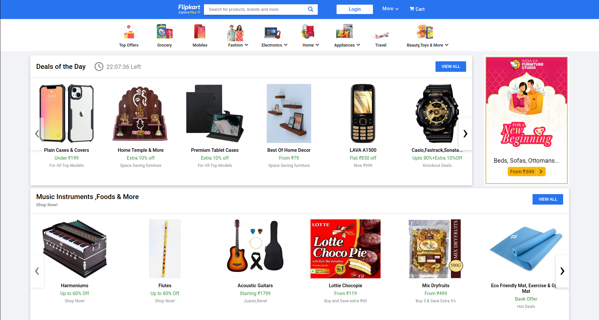
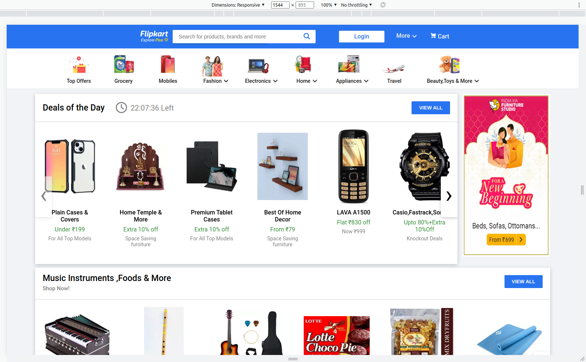
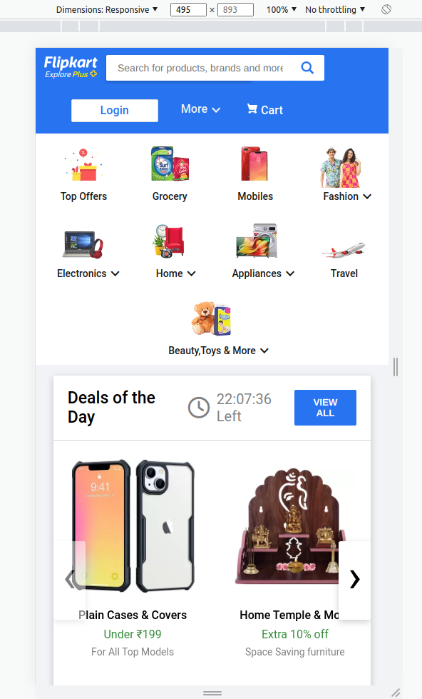
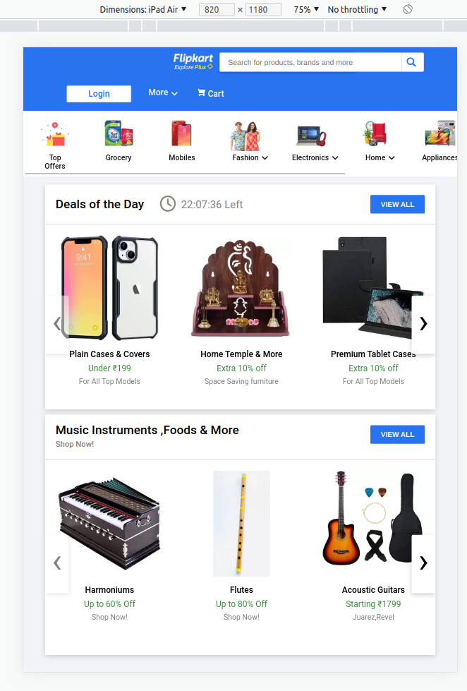

# FlipKart

## Site Link

[flipkart](https://jupinsimform.github.io/flipkart/)

## Site view for different Screen Resolution

## Desktop resolution

## Random resolution

## Random resolution

## ipad-Air resolution

## Description

## Carousel

    Here owl carousel library is used for carousel Purpose.
    [owl Carousel](https://owlcarousel2.github.io/OwlCarousel2/)

## Topic that covers in HTML LMS Course

    -What is HTML?
    -Structure of HTML Page
    -Elements and Attributes
    -Styling and Formatting
    -Images and Favicon
    -Tables and Lists
    -Block and Inline Elements
    -HTML Layout Elements
    -Responsiveness
    -HTML Semantics
    -Entities and Symbols
    -HTML Forms
    -HTML Graphics
    -HTML Media
    -Cross Browser HTML

## Topic that covers in CSS LMS Course

    -Introduction to CSS
    -CSS Selectors
    -Backgrounds and Borders
    -CSS Margins and Padding
    -Sizing and the Box Model
    -Text Formatting and Fonts
    -Styling anchors and lists
    -CSS Layout (display, max-width, max-hight, position, z-index, overflow, float, inline-block, horizontal & vertical-align)
    -CSS Combinators
    -Pseudo-class and Pseudo-element
    -CSS Attr Selectors
    -CSS Forms
    -CSS Box Sizing
    -Gradients and Shadows
    -CSS Media Queries
    -CSS Flex-box
    -CSS Grid

## Icons
